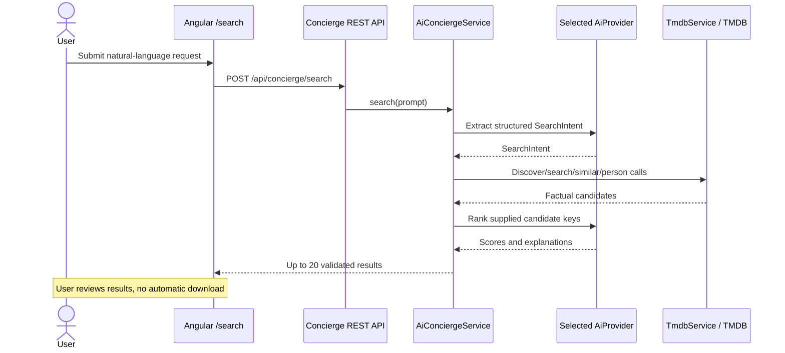

# AI Concierge

The AI Concierge augments the existing `/search` page with natural-language discovery. It is
stateless and never starts downloads. TMDB remains the source of factual titles and metadata;
Spring AI extracts intent and ranks only candidates supplied by the application.

## Architecture

```text
Angular /search
  -> POST /api/concierge/search
  -> AiConciergeController
  -> AiConciergeService
     -> AiProviderFactory -> OllamaAiProvider | OpenAiAiProvider
     -> ConciergeCandidateService -> TmdbService -> TMDB
     -> selected AiProvider (ranking)
  -> ranked movie/series DTOs
  -> existing movie and series detail components
```

Providers implement `AiProvider`; provider-specific Spring AI model setup is isolated in
`concierge.config` and provider implementations. Adding a provider requires a new enum value,
conditional `ChatModel` configuration, and an `AiProvider` implementation. The controller,
orchestration, TMDB integration, and frontend contract remain provider-independent.



## Packages

```text
ch.andreskonrad.torenta.concierge
├── config       Spring AI model and ChatClient configuration
├── controller   POST /api/concierge/search
├── dto          intent, candidate, ranking, request, and response records
└── service
    ├── orchestration, candidate retrieval, and genre mapping
    └── provider  provider interface, factory, Ollama, and OpenAI adapters
```

Frontend contracts are mirrored under `frontend/src/app/shared/dto/concierge`; the UI and HTTP
method remain in the existing `frontend/src/app/search` feature.

## Configuration

The non-sensitive defaults are tracked in `src/main/resources/application.properties`.

Ollama is the default:

```properties
app.ai.provider=OLLAMA
app.ai.logging.enabled=false
spring.ai.ollama.base-url=http://localhost:11434
app.ai.ollama.model=qwen3:8b
```

Install and start the model:

```bash
ollama pull qwen3:8b
ollama serve
```

OpenAI:

```properties
app.ai.provider=OPENAI
app.ai.openai.model=gpt-5
```

Save the OpenAI API key on the Preferences page before making a concierge request. The key is
loaded from user preferences when OpenAI is used, so it is never required in
`application.properties` and changing it does not require an application restart. A request made
without a saved key fails explicitly rather than falling back silently.

Both Ollama and OpenAI calls time out after 120 seconds. The browser stops waiting after 130
seconds, clears the loading state, and displays the concierge failure message if no response
arrives.

### Interaction logging

Set the following in `application.properties` to trace the complete concierge interaction:

```properties
app.ai.logging.enabled=true
```

The log order shows:

1. Intent-extraction system and user prompts.
2. The structured intent returned by the selected AI provider.
3. TMDB request URLs with the API key removed, followed by TMDB response bodies.
4. The ranking system and user prompts, including normalized intent and candidates.
5. The structured ranking returned by the AI provider.

The setting defaults to `false`. Enable it only for local diagnostics because prompts and
candidate metadata are written to the application log. API keys are never logged.

## Search intent and TMDB filters

Structured output maps requests to typed criteria. Every filter includes evidence copied from the
user's prompt:

```json
{
  "mediaType": "MOVIE",
  "moods": ["DARK"],
  "similarTo": null,
  "numericFilters": [],
  "dateFilters": [{
    "key": "PRIMARY_RELEASE_DATE",
    "operator": "GTE",
    "value": "2016-01-01",
    "evidence": "released after 2015"
  }],
  "textFilters": [],
  "booleanFilters": [],
  "namedFilters": [{
    "key": "GENRE",
    "names": ["Science Fiction"],
    "polarity": "INCLUDE",
    "matching": "ANY",
    "evidence": "sci-fi"
  }],
  "enumFilters": []
}
```

`mediaType` is `MOVIE`, `SERIES`, or `ANY`; an unspecified type becomes `ANY` and searches both
catalogs. The allowlisted registry covers all current movie and TV Discover filter families:
release/air dates, years, ratings, vote counts, runtime, locale/territory, certifications, content
flags, genres, people, companies, keywords, networks, watch providers, release/status/type and
monetization enums, sorting, and page selection. Media-specific criteria are sent only to compatible
endpoints.

The backend accepts a criterion only when its evidence occurs in the original request and its typed
value, operator, range, media support, and dependencies are valid. Invalid or unsupported optional
criteria are omitted rather than failing the request. This includes zero placeholders sometimes
returned by local models when the user did not request a numeric constraint.

Names such as actors, companies, keywords, genres, and watch providers are resolved through TMDB;
the model never supplies TMDB IDs. A name that cannot be resolved is omitted from the Discover
request, retained in the normalized intent, and evaluated during ranking. The backend selectively
loads factual candidate details needed for that ranking fallback. An unknown fact may not be
claimed as a match.

## API

```http
POST /api/concierge/search
Content-Type: application/json

{"prompt":"Recommend a dark sci-fi movie released after 2015"}
```

Example response:

```json
{
  "intent": {
    "mediaType": "MOVIE",
    "moods": ["DARK"],
    "similarTo": null,
    "numericFilters": [],
    "dateFilters": [{
      "key": "PRIMARY_RELEASE_DATE",
      "operator": "GTE",
      "value": "2016-01-01",
      "evidence": "released after 2015"
    }],
    "textFilters": [],
    "booleanFilters": [],
    "namedFilters": [{
      "key": "GENRE",
      "names": ["Science Fiction"],
      "polarity": "INCLUDE",
      "matching": "ANY",
      "evidence": "sci-fi"
    }],
    "enumFilters": []
  },
  "results": [
    {
      "rank": 1,
      "mediaType": "MOVIE",
      "id": 123,
      "title": "Title returned by TMDB",
      "overview": "Synopsis returned by TMDB.",
      "posterPath": "/poster.jpg",
      "releaseDate": "2020-01-01",
      "rating": 7.8,
      "explanation": "Its bleak tone and science-fiction premise closely match your request."
    }
  ]
}
```

Other example prompts:

- `Show me a series similar to Andor`
- `I have 2 hours tonight and want something funny`
- `Recommend a thriller with a rating above 7`
- `Find a German drama with Diego Luna`

The model receives fixed instructions to return structured intent rather than recommendations.
For ranking, it receives compact TMDB candidate records and must return existing candidate keys,
scores, and short explanations. The service discards unknown and duplicate keys, validates ranges,
excludes zero-score entries, and caps output at 20.

## Safety and testing

User prompts and candidate data are delimited as untrusted data. They are not logged by default;
explicit local interaction logging records prompts, structured responses, and candidate payloads
but still removes credentials. No torrent or download operation is registered as an AI tool.

The Playwright concierge test runs the real Angular and Spring Boot flow against a local HTTP
fixture that mocks Ollama and TMDB protocols. CI therefore requires no live model, AI key, TMDB
key, or internet access for this scenario.
