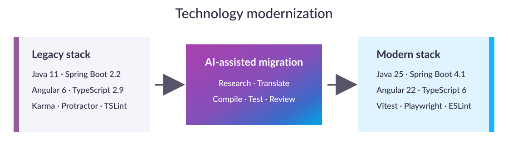
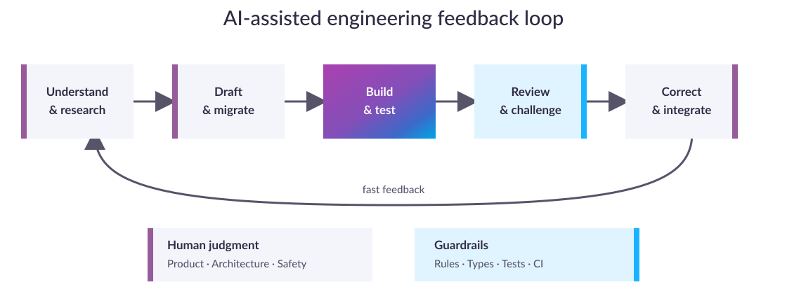

<!-- _class: lead -->
<!-- _paginate: false -->
<!-- _footer: "" -->

# Torenta

## Two Days from Legacy to Modern

**Four engineers · Two focused days · One releasable result**

> AI did not replace engineering. It compressed the path from an unfamiliar problem to a reviewed,
> tested, and integrated solution.

<!--
Timing: 20 seconds.

Open with the experiment: what can four engineers achieve in two days when AI is used across a
real legacy modernization—not as a demo, but with responsibility for the resulting application?
-->

---

<!-- _class: compact -->

# What is Torenta?

Torenta is a media discovery and download manager for movies and TV series.

It combines TMDB-powered search and recommendations with torrent discovery and downloading.

A local library keeps downloaded media organized and helps identify missing episodes.

---

<!-- _class: metrics -->

# Two days — one substantial result

| 👥 Team | 🔀 Delivery | 🛠️ Change | 🧪 Quality | 🛡️ Frontend audit |
| :---: | :---: | :---: | :---: | :---: |
| **4 engineers** | **87 commits** 14 merged PRs | **332 files** 42,703 line changes | **350 checks** 0 failed | **147 → 0** known findings |

In just **8 person-days**, modernization, product development, reliability, security,
accessibility, testing, CI, packaging, and documentation all moved forward together.

<!--
Timing: 45 seconds.

Emphasize breadth, not commit counts as an individual productivity ranking. This was much more than
a dependency update, and all figures represent the integrated two-day result.
-->

---

<!-- _class: diagram -->

# A leap across technology generations

**Angular crossed roughly 14 major versions**, alongside several generations of Java, Spring Boot,
Gradle, TypeScript, testing, linting, and API tooling.

<!--
Timing: 45 seconds.

Call out Java 11 to 25, Spring Boot 2.2 to 4.1, and Angular 6 to 22. The frontend now uses standalone
components, signals, lazy routes, modern templates, Material 3, and zoneless operation.
-->

---

<!-- _class: compact -->

# More than an upgrade

| 🔎 **Discover** | ⏬ **Download** | 📦 **Deliver** |
| --- | --- | --- |
| Natural-language **AI Concierge** | Durable, atomic state | Reproducible Gradle + npm build |
| Missing-episode **Recommendations** | Pause, restart, remove, delete | GitHub Actions quality gates |
| Typed intent + factual TMDB data | Recovery after restart | Portable ZIP + bundled runtime |
| Refreshed Material 3 experience | Safe, owned-file cleanup | No local Java required |

Clearer setup, actionable errors, light/dark themes, responsive feedback, and lazy loading completed
the product experience.

<!--
Timing: 55 seconds.

Keep this high level because the application demo will show the features. Mention that Concierge
never starts downloads automatically and Recommendations identifies aired but missing episodes.
-->

---

<!-- _class: diagram -->

# Where AI accelerated the work

AI shortened the expensive loops around **research, translation, repetitive drafting, context
recovery, and trial-and-error**.

<!--
Timing: 55 seconds.

Examples include understanding legacy behavior, translating framework patterns, drafting DTOs and
tests, and interpreting failures across Java, Angular, Gradle, npm, and CI. Human review remains
inside the loop rather than being a final ceremonial step.
-->

---

<!-- _class: metrics -->

# A striking productivity signal

| Observed AI-assisted outcome | Estimated classic approach |
| :---: | :---: |
| **8 person-days** | **42–65 person-days** |
| **2 elapsed days** | **13–20 elapsed days** |
| **1× invested effort** | **5–8× delivered throughput** |

> The largest gains were not from typing faster. They came from compressing the path to a
> **reviewed, testable solution**.

Repository-specific counterfactual estimate—not a controlled benchmark or universal AI factor.

<!--
Timing: 55 seconds.

State the qualification explicitly. This estimate applies to this repository, team, and broad
legacy-modernization scope. AI compressed search and feedback loops; it did not eliminate design,
testing, review, or integration.
-->

---

<!-- _class: compact -->

# Speed was credible because quality moved with it

| Signal | Result |
| --- | ---: |
| Automated checks | **346 passed · 4 skipped · 0 failed** |
| Backend line / branch coverage | **89.63% / 79.52%** |
| New test/spec files | **49 · 8,334 lines of test code** |
| Frontend dependency audit | **0 known findings across 624 dependencies** |
| Accessibility automation | **axe-core WCAG 2 A/AA route checks** |

**Tests + CI** caught regressions · **security boundaries** protected secrets and files ·
**accessibility** changed implementation · **reviews** challenged generated code

<!--
Timing: 55 seconds.

Be precise: the zero-finding audit covers the frontend dependency graph, not all backend
dependencies. Four checks remain skipped, two bundle budgets warn, and automated axe checks do not
replace manual accessibility testing.
-->

---

<!-- _class: compact -->

# What we learned (1/3)

### 1. AI as a Development Partner
AI can act as a mentor and productivity multiplier, helping developers solve unfamiliar problems and become more productive.
AI is particularly effective for low-level bug fixing, where problems can often be resolved much faster than manually.

### 2. Prompting & Context
Do not make assumptions. Ask questions until there is enough context to create a reliable plan.
Review and iterate on prompts: apply suggested improvements and validate the result with another model and the updated context.
OS-specific context matters: prompts and instructions should account for the target operating system, especially since AI cannot always test the result itself.

---

<!-- _class: compact -->

# What we learned (2/3)

### 3. Agent Autonomy & Control
There is a need to find the right balance between abstraction and agent autonomy.
Developers should understand how much complexity can safely be delegated to an agent before letting it execute independently.
Repeated approval requests such as “Allow once” can disrupt the workflow, highlighting the need for better approval/autopilot mechanisms.

### 4. AI for Maintenance
Dependency updates are a strong AI use case: AI/Copilot can make updates faster and cheaper while maintaining comparable quality.

---

<!-- _class: compact -->

# What we learned (3/3)

### 5. Accessibility
Accessibility should be considered throughout the project, rather than only when implementing individual features.
A key question is: When can we consider a feature truly accessible?

### 6. UI & Styling
AI is well suited for styling and UI-related tasks, making it a practical area for AI-assisted development.

---

<!-- _class: takeaway -->

# Our takeaway

> **AI widens the set of tasks engineers can tackle quickly.**
>
> Shared guardrails make that speed trustworthy—for juniors and seniors alike.

Engineering judgment · Architecture boundaries · Automated tests · Security rules · Human review

<!--
Timing: 35 seconds.

Avoid the framing that AI did the work instead of four engineers. The result came from four
engineers using AI to remove search, translation, boilerplate, and feedback-loop costs while
retaining responsibility.
-->

---

<!-- _class: lead -->
<!-- _paginate: false -->
<!-- _footer: "" -->

# Demo & Q&A

## Let’s take a quick tour of Torenta.

Sources: `../results/camp-achievements.md` · `../results/time-invest.md` · `../results/learnings.md`

<!--
Timing: 10 seconds.

Hand over to a broad application walkthrough, then invite questions.
-->
