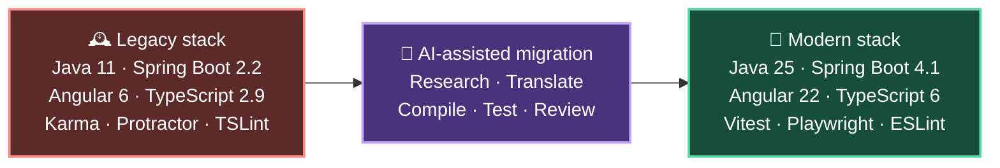
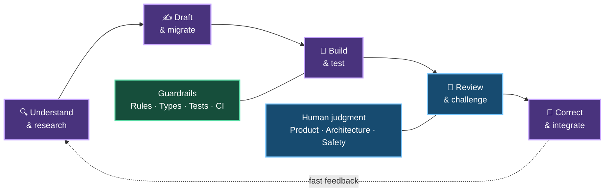

# 🚀 Torenta: Two Days from Legacy to Modern

### How four engineers used AI to modernize, extend, and ship a full-stack application

**Jambda Camp 2026 · 31 August–1 September**

> **The headline:** AI did not replace engineering. It compressed the path from an unfamiliar
> problem to a reviewed, tested, and integrated solution.

---

## 1 · Two days — one substantial result

| 👥 Team | 🔀 Delivery | 🛠️ Change | 🧪 Quality | 🛡️ Frontend audit |
| :---: | :---: | :---: | :---: | :---: |
| **4 engineers** | **87 commits** **14 merged PRs** | **332 files** **42,703 line changes** | **350 checks** **0 failed** | **147 findings → 0** |

In **8 person-days**, we transformed a long-unmaintained media application into a current,
testable, accessible, and distributable product — while adding major new capabilities.

> This was not a dependency update. Modernization, product development, reliability, security,
> accessibility, testing, CI, packaging, and documentation all moved forward together.

---

## 2 · A leap across technology generations

The frontend now uses **standalone components, signals, computed state, lazy routes, modern
templates, Material 3, and zoneless operation**. Obsolete test, lint, mocking, and API-documentation
tooling was replaced rather than carried forward.

**Why AI mattered:** the stack crossed roughly 14 Angular major versions plus several generations
of Java, Spring Boot, Gradle, TypeScript, and their surrounding ecosystems.

---

## 3 · More than an upgrade

| 🔎 **Discover** | ⏬ **Download** | 📦 **Deliver** |
| --- | --- | --- |
| Natural-language **AI Concierge** | Durable, atomic download state | Reproducible Gradle + npm build |
| Missing-episode **Recommendations** | Pause, restart, remove, stop & delete | GitHub Actions quality gates |
| Typed intent and factual TMDB data | Recovery after application restart | Portable ZIP with bundled runtime |
| Refreshed Material 3 experience | Safer paths and owned-file cleanup | No local Java installation required |

Additional improvements included clearer first-run setup, actionable errors, light/dark themes,
responsive feedback, lazy loading, and a consistent notification experience.

> **The demo:** a quick tour of the application will make these capabilities tangible.

---

## 4 · Where AI accelerated the work

AI shortened the expensive loops around engineering:

- navigating unfamiliar legacy code and documentation
- translating patterns across framework generations
- drafting repetitive migrations, DTOs, tests, mocks, configuration, and documentation
- interpreting build failures and review feedback across Java, Angular, Gradle, npm, and CI

It did **not** choose our product intent, own architectural trade-offs, approve unsafe deletion
behavior, validate the real application, or take responsibility for the result.

---

## 5 · A striking — but qualified — productivity signal

| Observed AI-assisted outcome | Estimated classic approach |
| :---: | :---: |
| **8 person-days** | **42–65 person-days** |
| **2 elapsed days** | **13–20 elapsed days** with the same team |
| **1× invested effort** | **5–8× the delivered throughput** |

The largest gains were not from typing production code faster. They came from reducing
**search, translation, boilerplate, context recovery, and trial-and-error**.

> ⚠️ **Keep this honest:** this is a reasoned counterfactual for this repository, this team, and
> this unusually broad modernization scope — not a controlled benchmark or a universal AI factor.

---

## 6 · Speed was credible because quality moved with it

| Signal | Result |
| --- | ---: |
| Automated checks | **346 passed · 4 skipped · 0 failed** |
| Backend line / branch coverage | **89.63% / 79.52%** |
| Test code added | **8,334 lines across 49 new test/spec files** |
| Frontend dependency audit | **0 known findings across 624 dependencies** |
| Accessibility automation | **axe-core WCAG 2 A/AA route checks** |

🧪 **Tests and CI** caught regressions.  
🛡️ **Security boundaries** protected secrets, paths, and download ownership.  
♿ **Accessibility work** changed semantics, feedback, controls, keyboard behavior, and tests.  
👀 **Human and AI-assisted reviews** challenged generated changes before integration.

The AI Concierge also uses explicit constraints: typed and evidence-backed intent, allowlisted
filters, factual TMDB candidates, bounded ranking, timeouts, and **no automatic downloads**.

<strong>Credibility note: what remains</strong>

Four checks are currently skipped, two production bundle budgets emit warnings, automated
accessibility checks cover only part of WCAG, and the zero-finding audit applies to the frontend
dependency graph — not every backend dependency.

---

## 7 · What we learned 💡

| Learning | What it means in practice |
| --- | --- |
| 🤝 **Treat AI as a development partner** | It can mentor, unblock unfamiliar work, and multiply productivity — especially for focused bug fixing. |
| 🎯 **Context determines quality** | Ask questions, remove assumptions, provide constraints, iterate on prompts, and verify the result. |
| 💻 **The environment is part of the prompt** | OS, toolchain, permissions, and what the agent can actually execute materially affect correctness. |
| 🎚️ **Match autonomy to risk** | Delegate only as much complexity as architecture, tests, reviews, and approval boundaries can safely support. |
| 🔄 **Maintenance is a strong use case** | Dependency upgrades and mechanical migrations combine research, repetition, and verification — ideal for assistance. |
| 🎨 **UI work benefits — accessibility must persist** | AI helps with styling and semantics, but accessibility is a continuous product concern, not a one-off task. |

> ### Our takeaway
>
> **AI widens the set of tasks engineers can tackle quickly. Shared guardrails make that speed
> trustworthy — for juniors and seniors alike.**

---

# 🎬 Demo & Q&A

### Let’s take a quick tour of Torenta.

---

Sources:
<a href="jambda-camp/results/camp-achievements.md">camp achievements</a> ·
<a href="jambda-camp/results/time-invest.md">effort estimate</a> ·
<a href="jambda-camp/results/learnings.md">learnings</a>

